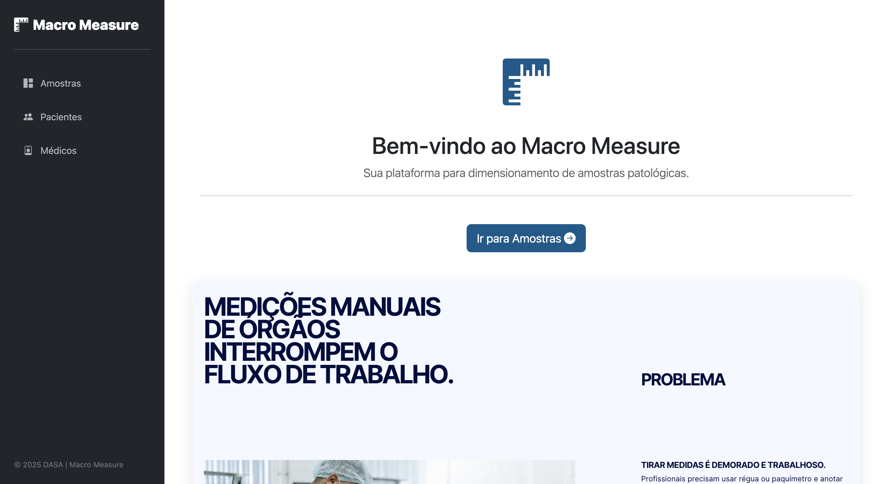
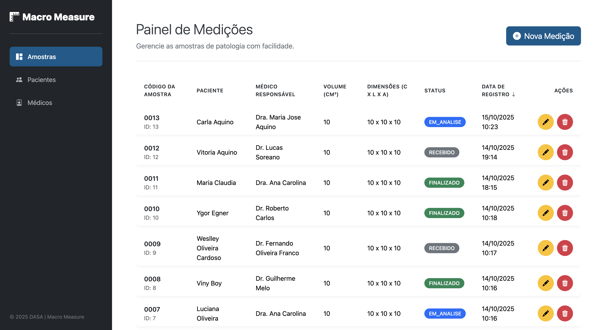
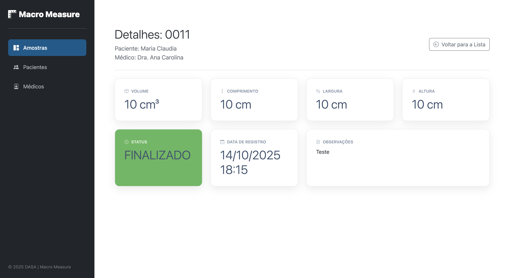
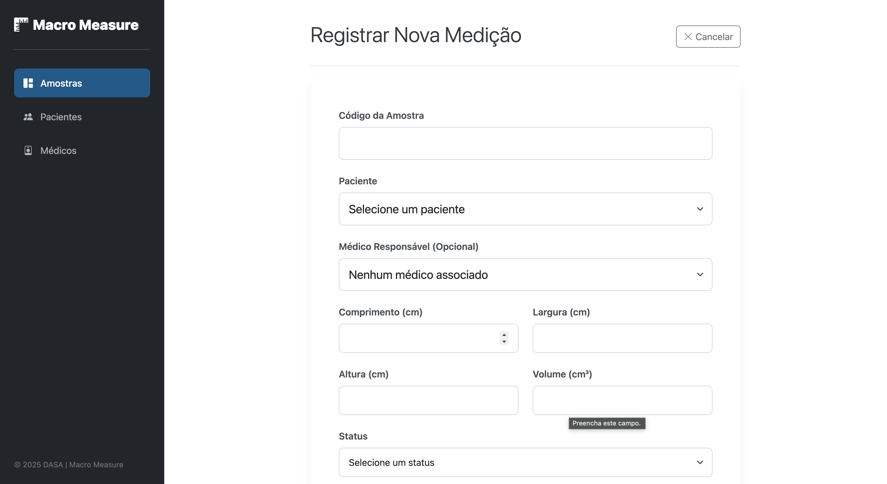
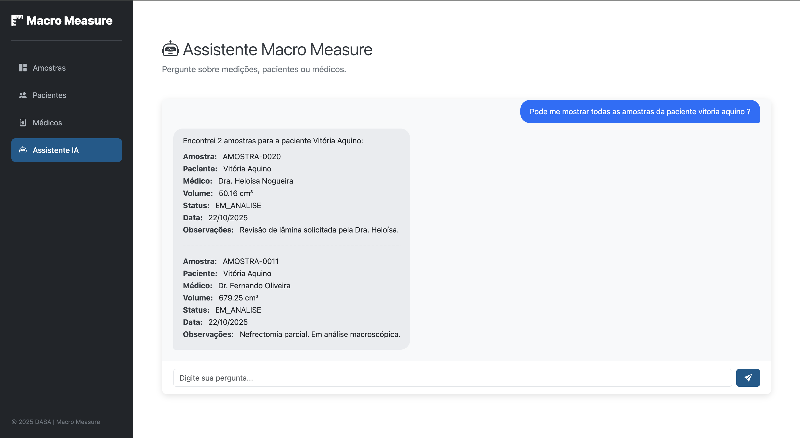
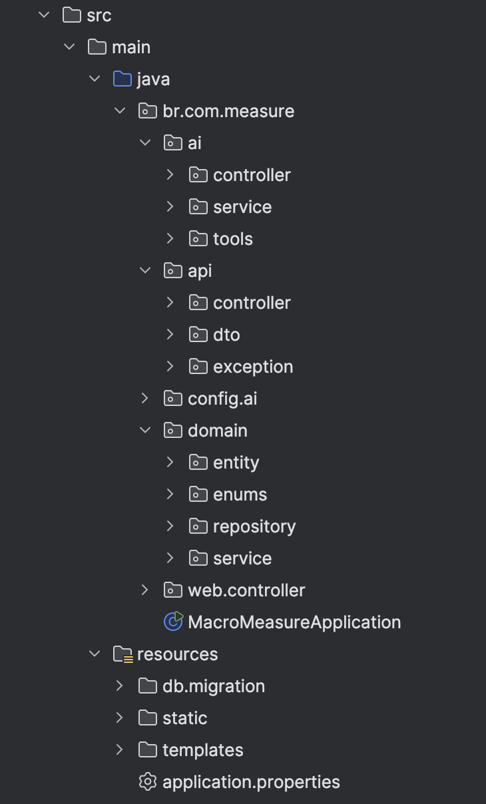
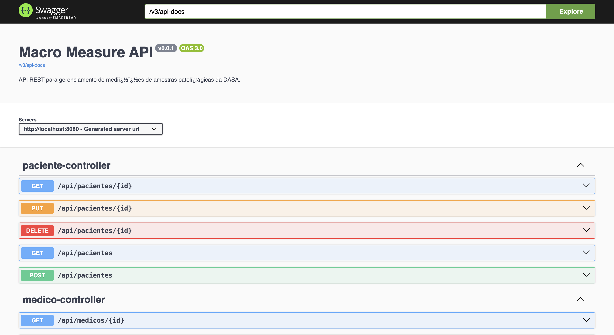
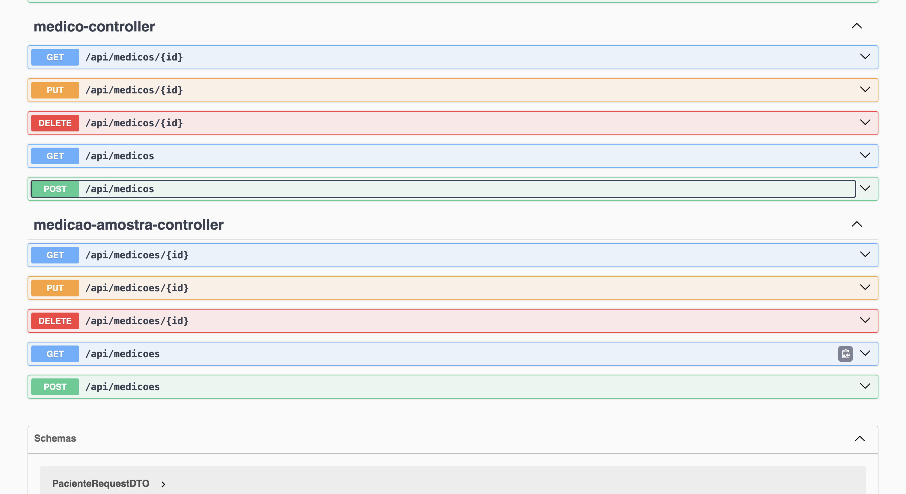
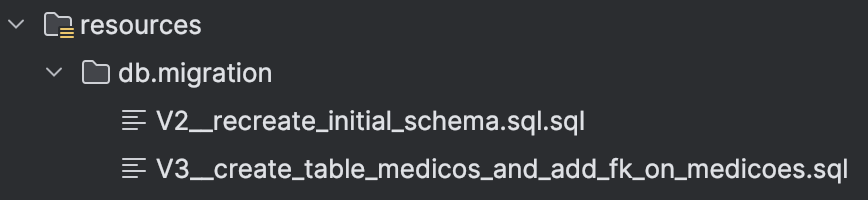

# Macro Measure 


Aplicação web full-stack para digitalizar e gerenciar a medição de amostras patológicas. Construída com uma API RESTful, um dashboard completo para CRUD (Amostras, Pacientes, Médicos) e um **Assistente de IA** integrado com LangChain4j.

**Stack Principal:** Java 21, Spring Boot, LangChain4j, OpenAI, JPA, Hibernate, Thymeleaf, Oracle e Flyway.

---

### 📖 Tabela de Conteúdos

- [Sobre o Projeto](#-sobre-o-projeto)
- [✨ Principais Funcionalidades](#-principais-funcionalidades)
- [🤖 Assistente de IA](#-assistente-de-ia)
- [📸 Screenshots](#-screenshots)
- [🛠️ Pilha de Tecnologias](#️-pilha-de-tecnologias)
- [🏛️ Arquitetura do Projeto](#️-arquitetura-do-projeto)
- [🚀 Como Executar o Projeto](#-como-executar-o-projeto)
- [📄 Documentação da API](#-documentação-da-api)
- [🗃️ Migrações do Banco de Dados](#️-migrações-do-banco-de-dados)
- [👨‍💻 Autor](#-autor)
- [📜 Licença](#-licença)

---

### 🎯 Sobre o Projeto

O **Macro Measure** é uma aplicação web full-stack desenvolvida em Java para a DASA, com o objetivo de modernizar e otimizar o processo de medição de amostras patológicas. A solução substitui processos manuais por um fluxo de trabalho digital, centralizado e rastreável, garantindo maior precisão, integridade dos dados e eficiência operacional.

Além das funcionalidades de gerenciamento, o projeto conta com um **Assistente de IA** que permite aos usuários consultar dados complexos do sistema usando linguagem natural.

---

### ✨ Principais Funcionalidades

- **Gerenciamento de Amostras:** CRUD completo para registrar, visualizar, editar e excluir medições de amostras.
- **Gerenciamento de Pacientes e Médicos:** Cadastros dedicados para pacientes e médicos, permitindo a associação correta com as amostras.
- **Assistente de IA Conversacional:** Um chatbot integrado que utiliza `LangChain4j` para responder perguntas complexas sobre os dados, como "liste as amostras do Dr. Fernando com status FINALIZADO" ou "qual o CPF do paciente Ygor?".
- **Dashboard Interativo:** Tela principal para listagem de amostras com funcionalidades de ordenação e acesso rápido aos detalhes.
- **Visualização Detalhada:** Uma tela de detalhes moderna em formato de widgets para cada amostra, facilitando a visualização rápida das informações.
- **API RESTful:** Endpoints REST para todas as entidades principais, permitindo integrações futuras com outros sistemas.

---

### 🤖 Assistente de IA

O núcleo de IA do projeto é construído sobre o `dev.langchain4j` e segue a arquitetura de **Agente & Ferramentas**:

- **Agente (`MacroMeasureAgent`):** Uma interface `@AiService` define a "constituição" (system prompt) do agente, instruindo-o sobre como se comportar e quais ferramentas ele pode usar.
- **Ferramentas (`MacroMeasureTools`):** Uma classe `@Component` que atua como uma "ponte". Ela injeta os `Services` de negócio do Spring (ex: `PacienteService`, `MedicoService`) e expõe métodos Java seguros para o agente, anotados com `@Tool`.
- **Funcionamento:** Quando um usuário envia uma pergunta (ex: "quantas amostras o paciente ID 8 tem?"), o Agente:
    1.  Analisa a pergunta.
    2.  Consulta sua "constituição" (`@SystemMessage`).
    3.  Escolhe a ferramenta Java correta: `contarMedicoes(pacienteId=8, ...)`.
    4.  A ferramenta `@Tool` executa a lógica de negócio em Java (filtrando em `MedicaoAmostraService`).
    5.  A ferramenta retorna o resultado (ex: `long 2`).
    6.  O Agente formata esse resultado em uma resposta amigável (ex: "O paciente ID 8 possui 2 amostras.").

Essa arquitetura garante que a IA nunca acesse o banco de dados diretamente, mantendo a segurança e a precisão dos dados, ao mesmo tempo que oferece uma interface de usuário poderosa e flexível.

---

### 📸 Screenshots

Esta seção apresenta as principais telas da aplicação, demonstrando o fluxo de uso e o design da interface.

#### 1. Página Inicial
A porta de entrada do projeto, com uma apresentação incorporada que detalha os objetivos e funcionalidades do Macro Measure.


#### 2. Dashboard Principal
A tela central para o gerenciamento de amostras, exibindo os registros em uma tabela interativa com opções de ordenação e acesso rápido às ações.


#### 3. Tela de Detalhes da Amostra
Visualização detalhada de uma medição específica, apresentada em um layout de widgets para facilitar a leitura rápida e clara das informações.


#### 4. Formulário de Cadastro
O formulário para registrar uma nova medição, com campos para associar pacientes, médicos e inserir todas as dimensões e observações da amostra.


#### 5. Assistente de IA (Chatbot)
A interface de chat onde os usuários podem interagir com o Agente LangChain4j para fazer consultas em linguagem natural.


---

### 🛠️ Pilha de Tecnologias

A aplicação foi construída utilizando tecnologias modernas e robustas do ecossistema Java.

- **Backend:**
    - `Java 21`
    - `Spring Boot 3.3.0`
    - `Spring Web` (Para a construção de APIs REST e controllers MVC)
    - `Spring Data JPA` (Para persistência de dados de forma simplificada)
    - `Hibernate` (Framework ORM para mapeamento objeto-relacional)

- **Inteligência Artificial (Agente):**
    - `LangChain4j` (Framework de Agente de IA e integração com LLMs)
    - `langchain4j-spring-boot-starter` (Para integração nativa com Spring)
    - `OpenAI` (Modelo de LLM `gpt-3.5-turbo` utilizado pelo agente)

- **Frontend:**
    - `Thymeleaf` (Motor de templates para renderização no lado do servidor)
    - `HTML5` & `CSS3` (com Bootstrap 5)

- **Banco de Dados:**
    - `Oracle Database`
    - `Flyway` (Para gerenciamento e versionamento das migrações do schema)

- **Ferramentas e Outros:**
    - `Maven` (Gerenciador de dependências e build do projeto)
    - `Lombok` (Para redução de código boilerplate)
    - `SpringDoc (OpenAPI/Swagger)` (Para documentação automática da API)

---

### 🏛️ Arquitetura do Projeto

O projeto segue uma **Arquitetura em Camadas** clara, promovendo a separação de responsabilidades.



- **`domain`**: Camada de domínio, contendo:
    - **`entity`**: As classes que representam as tabelas do banco de dados (ex: `MedicaoAmostra`), anotadas com JPA.
    - **`repository`**: As interfaces `JpaRepository` responsáveis pela abstração do acesso aos dados.
    - **`service`**: Onde reside a lógica de negócio principal (ex: `PacienteService`).
- **`api`**: Camada de exposição da API REST, contendo:
    - **`controller`**: Classes `@RestController` (ex: `/api/medicoes`).
    - **`dto`**: Data Transfer Objects (DTOs) para desacoplar a API das entidades.
    - **`exception`**: Classes para tratamento global de exceções.
- **`web`**: Camada de apresentação web (Frontend), contendo:
    - **`controller`**: Classes `@Controller` responsáveis por renderizar as páginas Thymeleaf (ex: `DashboardController`).
- **`ai`**: Camada do Agente de Inteligência Artificial, contendo:
    - **`controller`**: O `@RestController` que expõe o chatbot.
    - **`service`**: A interface `@AiService` que define o agente.
    - **`tools`**: A classe `@Component` que define as `@Tools` que o agente pode usar.

---

### 🚀 Como Executar o Projeto

**Pré-requisitos:**
- JDK 21 ou superior
- Maven 3.8+
- Acesso a um banco de dados Oracle
- Uma API Key da OpenAI

**Passos:**

1.  **Clone o repositório:**
    ```bash
    git clone [https://github.com/Carti011/Macro-Measure.git](https://github.com/Carti011/Macro-Measure.git)
    ```
    *(Atualizei com a URL do seu `git status`)*

2.  **Configure o Banco de Dados:**
    - Abra o arquivo `src/main/resources/application.properties`.
    - Altere as propriedades `spring.datasource.url`, `spring.datasource.username` e `spring.datasource.password` com as credenciais do seu banco de dados Oracle.

3.  **Configure a API Key da OpenAI:**
    - No mesmo arquivo `src/main/resources/application.properties`.
    - Altere a propriedade `langchain4j.open-ai.chat-model.api-key` com sua chave da OpenAI.
    - **(Recomendado)** Como melhor prática, remova a chave do arquivo e configure-a como uma variável de ambiente (`OPENAI_API_KEY`). O `AiConfig.java` está pronto para ler isso.

4.  **Execute a aplicação:**
    - Navegue até a raiz do projeto e execute o seguinte comando no terminal:
    ```bash
    mvn spring-boot:run
    ```

5.  **Acesse a aplicação:**
    - **Página Inicial:** `http://localhost:8080/`
    - **Dashboard de Amostras:** `http://localhost:8080/dashboard`
    - **Assistente de IA:** `http://localhost:8080/chatbot`
    - **Documentação da API:** `http://localhost:8080/swagger-ui.html`

---

### 📄 Documentação da API

A documentação completa da API REST está disponível e é gerada automaticamente pelo SpringDoc. Após iniciar a aplicação, acesse:

- **Swagger UI:** `http://localhost:8080/swagger-ui.html`




---

### 🗃️ Migrações do Banco de Dados

O schema do banco de dados é gerenciado pelo **Flyway**. As migrações são arquivos SQL versionados e se encontram em `src/main/resources/db/migration`. O Flyway aplica automaticamente as migrações pendentes ao iniciar a aplicação.



---

### 👨‍💻 Autor

**Weslley Cardoso**

- LinkedIn: `https://www.linkedin.com/in/weslleycarti/`
- GitHub: `@Carti011`

---

### 📜 Licença

Este projeto está sob a licença MIT.
