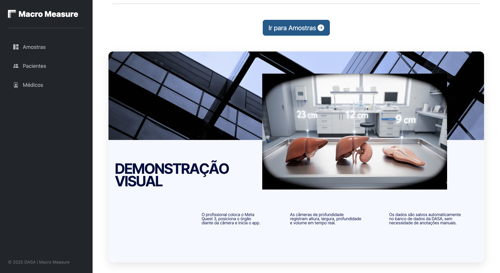
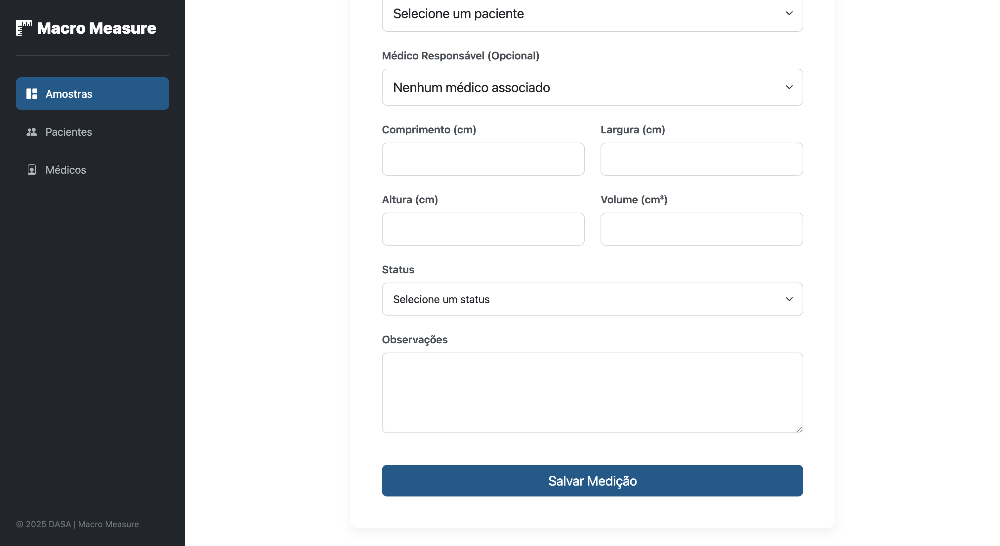

# Macro Measure  माप


Aplicação web full-stack para digitalizar e gerenciar a medição de amostras patológicas. Construída com uma API RESTful para integrações e um dashboard completo para CRUD de amostras, pacientes e médicos. Stack: Java 21, Spring Boot, JPA, Hibernate, Thymeleaf, Oracle e Flyway.

---

### 📖 Tabela de Conteúdos

- [Sobre o Projeto](#-sobre-o-projeto)
- [✨ Principais Funcionalidades](#-principais-funcionalidades)
- [📸 Screenshots](#-screenshots)
- [🛠️ Pilha de Tecnologias](#️-pilha-de-tecnologias)
- [🏛️ Arquitetura do Projeto](#️-arquitetura-do-projeto)
- [🚀 Como Executar o Projeto](#-como-executar-o-projeto)
- [📄 Documentação da API](#-documentação-da-api)
- [🗃️ Migrações do Banco de Dados](#️-migrações-do-banco-de-dados)
- [👨‍💻 Autor](#-autor)
- [📜 Licença](#-licença)

---

### 🎯 Sobre o Projeto

O **Macro Measure** é uma aplicação web full-stack desenvolvida em Java para a DASA, com o objetivo de modernizar e otimizar o processo de medição de amostras patológicas. A solução substitui processos manuais por um fluxo de trabalho digital, centralizado e rastreável, garantindo maior precisão, integridade dos dados e eficiência operacional.

---

### ✨ Principais Funcionalidades

- **Gerenciamento de Amostras:** CRUD completo para registrar, visualizar, editar e excluir medições de amostras.
- **Gerenciamento de Pacientes e Médicos:** Cadastros dedicados para pacientes e médicos, permitindo a associação correta com as amostras.
- **Dashboard Interativo:** Tela principal para listagem de amostras com funcionalidades de ordenação e acesso rápido aos detalhes.
- **Visualização Detalhada:** Uma tela de detalhes moderna em formato de widgets para cada amostra, facilitando a visualização rápida das informações.
- **API RESTful:** Endpoints REST para todas as entidades principais, permitindo integrações futuras com outros sistemas.

---

### 📸 Screenshots

Esta seção apresenta as principais telas da aplicação, demonstrando o fluxo de uso e o design da interface.

#### **1. Página Inicial**
A porta de entrada do projeto, com uma apresentação incorporada que detalha os objetivos e funcionalidades do Macro Measure.




#### **2. Dashboard Principal**
A tela central para o gerenciamento de amostras, exibindo os registros em uma tabela interativa com opções de ordenação e acesso rápido às ações.


#### **3. Tela de Detalhes da Amostra**
Visualização detalhada de uma medição específica, apresentada em um layout de widgets para facilitar a leitura rápida e clara das informações.


#### **4. Formulário de Cadastro**
O formulário para registrar uma nova medição, com campos para associar pacientes, médicos e inserir todas as dimensões e observações da amostra.




---

### 🛠️ Pilha de Tecnologias

A aplicação foi construída utilizando tecnologias modernas e robustas do ecossistema Java.

- **Backend:**
    - `Java 21`
    - `Spring Boot 3.3.0`
    - `Spring Web` (Para a construção de APIs REST e controllers MVC)
    - `Spring Data JPA` (Para persistência de dados de forma simplificada)
    - `Hibernate` (Framework ORM para mapeamento objeto-relacional)

- **Frontend:**
    - `Thymeleaf` (Motor de templates para renderização no lado do servidor)
    - `HTML5` & `CSS3`
    - `Bootstrap 5` (Para componentização e responsividade)

- **Banco de Dados:**
    - `Oracle Database`
    - `Flyway` (Para gerenciamento e versionamento das migrações do schema)

- **Ferramentas e Outros:**
    - `Maven` (Gerenciador de dependências e build do projeto)
    - `Lombok` (Para redução de código boilerplate em entidades e DTOs)
    - `SpringDoc (OpenAPI/Swagger)` (Para documentação automática da API)

---

### 🏛️ Arquitetura do Projeto

O projeto segue uma **Arquitetura em Camadas** clássica, promovendo a separação de responsabilidades, alta coesão e baixo acoplamento entre os componentes.


- **`domain`**: Camada de domínio, contendo:
    - **`entity`**: As classes que representam as tabelas do banco de dados (ex: `MedicaoAmostra`), anotadas com JPA.
    - **`repository`**: As interfaces que estendem `JpaRepository`, responsáveis pela abstração do acesso aos dados.
    - **`service`**: Onde reside a lógica de negócio principal da aplicação.
    - **`enums`**: Enumerações utilizadas no domínio.

- **`api`**: Camada de exposição da API REST, contendo:
    - **`controller`**: Classes `@RestController` que definem os endpoints da API (ex: `/api/medicoes`).
    - **`dto`**: Data Transfer Objects (DTOs) para desacoplar a API das entidades de domínio, seguindo o padrão Request/Response.
    - **`exception`**: Classes para tratamento global de exceções da API.

- **`web`**: Camada de apresentação web, contendo:
    - **`controller`**: Classes `@Controller` responsáveis por renderizar as páginas Thymeleaf.

Essa estrutura garante que a lógica de negócio (`service`) seja completamente independente tanto da forma como os dados são expostos (seja por uma API REST ou por uma página web) quanto da forma como são persistidos.

---

### 🚀 Como Executar o Projeto

**Pré-requisitos:**
- JDK 21 ou superior
- Maven 3.8+
- Acesso a um banco de dados Oracle

**Passos:**

1.  **Clone o repositório:**
    ```bash
    git clone [https://github.com/seu-usuario/macro-measure.git](https://github.com/seu-usuario/macro-measure.git)
    ```

2.  **Configure o Banco de Dados:**
    - Abra o arquivo `src/main/resources/application.properties`.
    - Altere as propriedades `spring.datasource.url`, `spring.datasource.username` e `spring.datasource.password` com as credenciais do seu banco de dados Oracle.

3.  **Execute a aplicação:**
    - Navegue até a raiz do projeto e execute o seguinte comando no terminal:
    ```bash
    mvn spring-boot:run
    ```

4.  **Acesse a aplicação:**
    - **Página Inicial:** `http://localhost:8080/`
    - **Dashboard de Amostras:** `http://localhost:8080/dashboard`

---

### 📄 Documentação da API

A documentação completa da API REST está disponível e é gerada automaticamente pelo SpringDoc. Após iniciar a aplicação, acesse:

- **Swagger UI:** `http://localhost:8080/swagger-ui.html`


---

### 🗃️ Migrações do Banco de Dados

O schema do banco de dados é gerenciado pelo **Flyway**. As migrações são arquivos SQL versionados e se encontram em `src/main/resources/db/migration`. O Flyway aplica automaticamente as migrações pendentes ao iniciar a aplicação, garantindo que o banco de dados esteja sempre sincronizado com a versão do código.


---

### 👨‍💻 Autor

**Weslley Cardoso**

- LinkedIn: `https://www.linkedin.com/in/weslleycarti/`
- GitHub: `@Carti011`

---

### 📜 Licença

Este projeto está sob a licença MIT. Veja o arquivo [LICENSE](LICENSE) para mais detalhes.